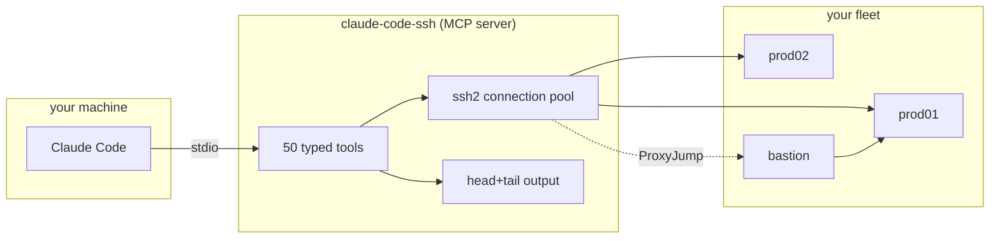

<p align="center">
  
</p>

<p align="center">
  
</p>

<p align="center">
  <a href="https://github.com/hunchom/claude-code-ssh/actions/workflows/test.yml"></a>
  <a href="https://github.com/hunchom/claude-code-ssh/blob/main/LICENSE"></a>
  
  
  <a href="https://github.com/hunchom/claude-code-ssh/releases"></a>
</p>

<p align="center">
  <a href="#why">Why</a>
  &middot;
  <a href="#install">Install</a>
  &middot;
  <a href="#configure">Configure</a>
  &middot;
  <a href="#safety">Safety</a>
  &middot;
  <a href="#limitations">Limitations</a>
  &middot;
  <a href="#vs-raw-ssh--bash">vs raw ssh</a>
  &middot;
  <a href="https://github.com/hunchom/claude-code-ssh/wiki">Wiki</a>
</p>

---

An MCP server that gives Claude Code direct, typed SSH access to your server fleet. Fifty-one tools across seven opt-in groups (`core`, `sessions`, `monitoring`, `backup`, `database`, `advanced`, `gamechanger`). Connection-pooled. Head-plus-tail output truncation. Sudo passwords on stdin, never argv. The query tool refuses anything but `SELECT`.

<table>
<tr>
<td width="50%" valign="top">

### From a Claude Code session

```text
list my ssh servers
health check prod01
back up payments db, restore to staging01
roll this nginx.conf to every web server, pause on healthcheck fail
tunnel grafana.internal:3000 through bastion
```

</td>
<td width="50%" valign="top">

### From the shell

```bash
./cli/ssh-manager server add
./cli/ssh-manager server test prod01
./cli/ssh-manager tools configure
./cli/ssh-manager tools list
claude mcp add ssh-manager node "$(pwd)/src/index.js"
```

</td>
</tr>
</table>

---

## Why

Without an MCP, fleet ops through Claude looks like this:

```
you:    back up the payments db from prod01 and restore it to prod02
Claude: which host is prod01? what user runs pg_dump? what key? which port?
        does prod02 accept the same auth? what's the backup path?
        [rebuilds the same bash one-liner it rebuilt last Tuesday]
```

With claude-code-ssh:

```
you:    back up the payments db from prod01 and restore it to prod02
Claude: [ssh_backup_create] [ssh_download] [ssh_backup_restore]
        done. dump is payments-2026-04-14.sql.gz (~340 MB). prod02 back in sync.
```

Fleet context lives in a config Claude reads once and keeps. Every tool is typed, pooled, head+tail truncated, sudo/password-safe by construction.

## What changes

| | Before | After |
|---|---|---|
| **Production debug** | alt-tab between chat and three terminals | "prod01 is 502-ing" → Claude pulls journal, spots upstream timeout, fixes it |
| **Fleet rollout** | Ansible playbook or tmux + for-loop | "roll this config to every web server, pause on healthcheck fail" |
| **Session memory** | re-brief Claude every chat | fleet declared once, remembered across every session |
| **Output overhead** | one `journalctl --no-pager` eats the context window | head+tail truncation, ASCII tables |
| **Connection cost** | every command: fresh TCP + TLS + auth handshake | pooled, 30-minute idle timeout |
| **Safety footguns** | sudo password in argv, Claude can `DROP TABLE` | stdin-only sudo, SELECT-only SQL parser |

## What it is



- **50 typed tools across 7 groups** — shell, files, databases, backups, deploys, tunnels, sessions. Claude picks; you never enumerate.
- **Pooled connections** — 30-minute idle timeout. Reconnects cost zero.
- **Opt-in per group** — minimal mode (5 tools, ~3.5k tokens) to full mode (50 tools, ~43k tokens).

## Install

```bash
git clone https://github.com/hunchom/claude-code-ssh
cd claude-code-ssh
npm install
cp .env.example .env       # add your servers
claude mcp add ssh-manager node "$(pwd)/src/index.js"
```

## Configure

`.env` for Claude Code:

```
SSH_SERVER_PROD01_HOST=10.0.0.10
SSH_SERVER_PROD01_USER=deploy
SSH_SERVER_PROD01_KEYPATH=~/.ssh/id_ed25519
SSH_SERVER_PROD01_DEFAULT_DIR=/var/www/app
SSH_SERVER_PROD01_PROXYJUMP=bastion
```

TOML for Codex (`~/.codex/ssh-config.toml`):

```toml
[ssh_servers.prod01]
host = "10.0.0.10"
user = "deploy"
key_path = "~/.ssh/id_ed25519"
default_dir = "/var/www/app"
proxy_jump = "bastion"
```

## Ask Claude things like

```
why is prod01 returning 502s
show me disk usage on every web server
nginx config on prod02 is rejecting the /api/ route, find and fix it
back up the payments db, download the dump, then restore it to staging
deploy ./build to prod01:/var/www/app, atomic, rollback on healthcheck fail
open a tunnel to the internal grafana through bastion
tail the last 500 lines of journalctl for docker on prod03
```

You're not picking tools. You're describing outcomes.

## Safety

Prod access deserves care. This server doesn't hand Claude a raw shell — every tool is narrow and auditable:

- **Sudo passwords** go in via stdin, never argv — they can't leak into process listings
- **DB passwords** travel through env vars (`MYSQL_PWD`, `PGPASSWORD`, connection URIs), never on the command line
- **The query tool** uses a token-level SQL parser that rejects anything but read-only SELECTs — Claude can't `DROP TABLE` by accident
- **Host fingerprints** use SHA256, no TOFU regex — MITM resistant by default
- **ProxyJump/bastion** chains work transparently, so you don't have to punch holes in your network

Pre-commit hooks scan for leaked secrets before push. Every SSH connection pools and times out after 30min idle. Every tool group can be disabled per-project, so dev environments don't see prod tooling.

## Tool groups

| Group | Count | What it covers |
|---|---:|---|
| core | 5 | execute, upload, download, list, health |
| sessions | 4 | persistent shells that survive between turns |
| monitoring | 6 | services, processes, logs, alerts |
| backup | 4 | dump / list / restore / schedule |
| database | 4 | dump, import, list, read-only query |
| advanced | 14 | tunnels, keys, sync, deploy, hooks |
| gamechanger | 14 | cat, diff, edit, docker, journalctl, port-test |

`ssh-manager tools configure` lets you pick which groups load.

## vs raw `ssh` + bash

Claude already has a bash tool. Why this server?

| | `ssh` + bash | claude-code-ssh |
|---|---|---|
| Fleet memory across sessions | you re-brief every chat | declared once, remembered forever |
| Output truncation | full `journalctl` blows the context window | head+tail, ASCII tables |
| Connection handshake | every command is a new TCP + TLS + auth | pooled, 30min idle timeout |
| Sudo password handling | argv / `echo pwd \| sudo -S` (leaks to `ps`) | stdin only, never argv |
| DB query safety | Claude can send `DROP TABLE` | token-level SQL parser, SELECT only |
| Host key verification | TOFU by default, no MITM check | SHA256 fingerprint match, strict mode available |
| Tool surface | 1 generic shell exec | 50 typed tools with JSON schemas |
| Context cost | unbounded per command | ~3.5k tokens minimal mode, ~43k full |

The pitch isn't "Claude couldn't SSH before." The pitch is "Claude could SSH, but badly — and one bad command on prod is one too many."

## Limitations

What this doesn't do, today, honestly:

- **No Windows SSH server support.** The platform flag exists, but most tools assume POSIX shell, systemd, and coreutils. If you run OpenSSH on Windows, `ssh_execute` works for simple commands; `ssh_service_status`, `ssh_journalctl`, `ssh_docker`, `ssh_systemctl` do not.
- **No Kerberos / GSSAPI auth.** The underlying `ssh2` library supports password, key, and agent auth only. Enterprise AD-bound hosts won't work.
- **`ssh_db_query` is read-only.** The token-level SQL parser rejects anything but `SELECT`. For writes, go through `ssh_execute` against the DB CLI — that's intentional, not a roadmap item.
- **No connection failover or HA.** Pool is single-host. If a pooled connection dies, the next command reconnects fresh. There's no cross-host retry, no cluster awareness, no active/passive failover.

## Testing

```bash
npm test       # 551 tests across 26 suites
```

## Layout

```
src/
  index.js                 MCP server + tool registration
  tools/                   17 modular handler files
  tool-registry.js         group metadata
  tool-config-manager.js   per-user enablement
  logger.js                [info]/[warn]/[err] tagged stderr
  stream-exec.js           streaming exec with backpressure
cli/ssh-manager            bash CLI
tests/                     test suites
profiles/                  project templates
docs/                      tool management docs
```

## License

MIT.
