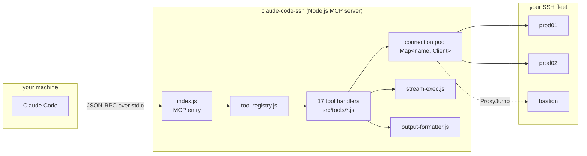
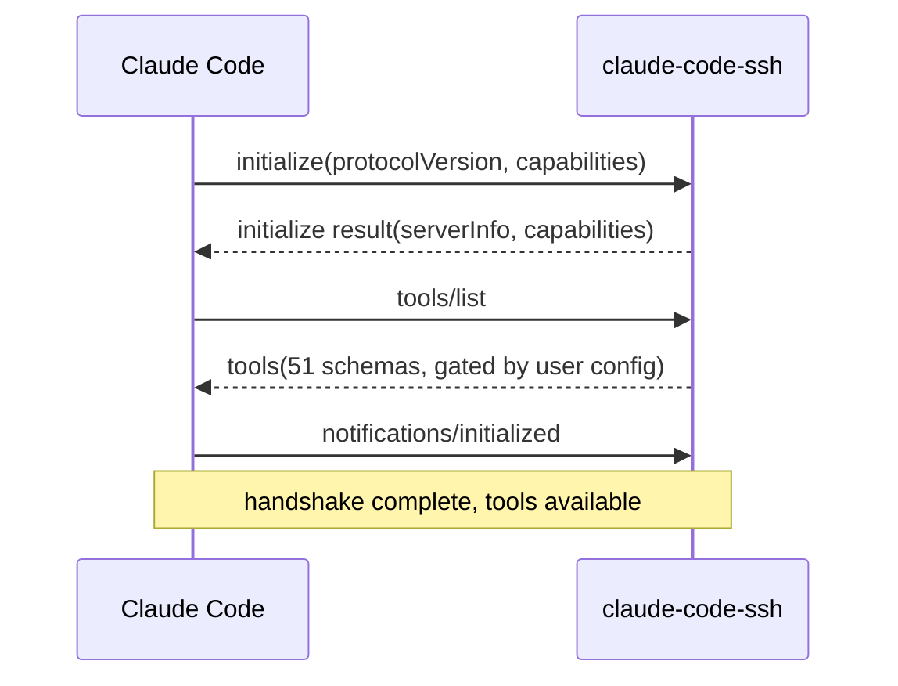
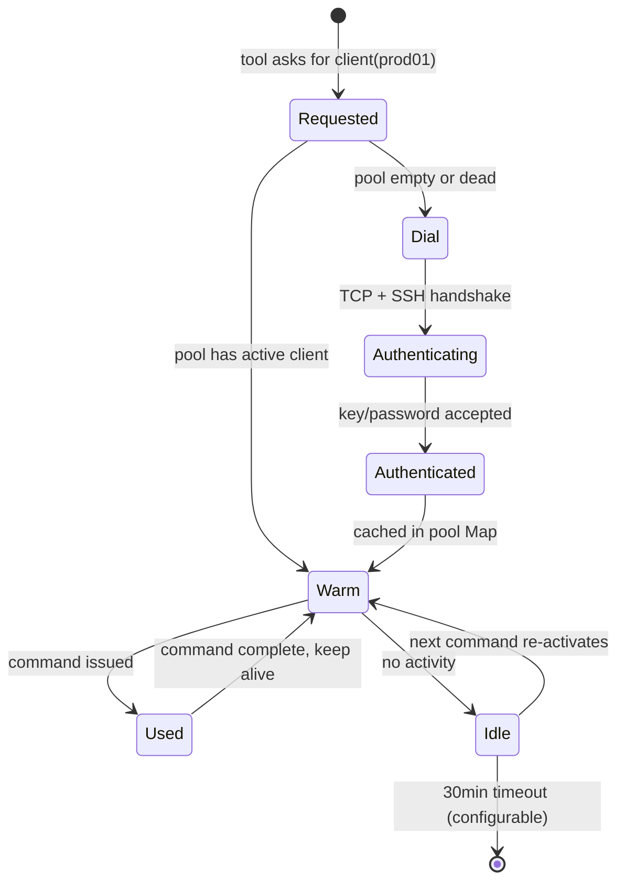
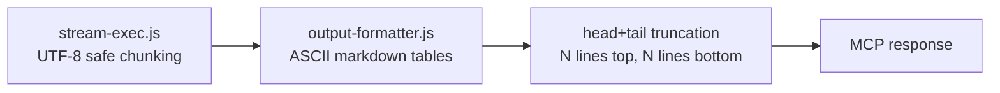
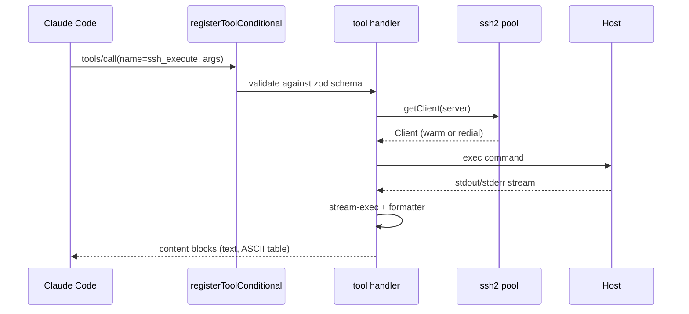

# Architecture

How the MCP server, connection pool, and tool layer fit together.

## 30-second mental model

## The MCP handshake

When Claude Code starts the server, these are the messages:

The 51-schema payload is ~43k tokens in full mode. Per-user gating (via `~/.ssh-manager/tools-config.json`) trims the payload to only enabled groups.

## Tool registration

`src/index.js` registers tools conditionally via `registerToolConditional()`:

- The registry (`src/tool-registry.js`) defines 7 groups with their tool names.
- At startup, the config manager (`src/tool-config-manager.js`) reads `~/.ssh-manager/tools-config.json`.
- For each tool in an enabled group, the handler is imported from `src/tools/*.js` and registered.
- Disabled groups never load their handlers — saving both startup time and MCP schema payload.

## Connection pool lifecycle

Key properties:

- **One pool entry per server name** — Map keyed by `name` (not IP, so aliases share the pool).
- **Alias resolution** — names are normalized to lowercase; aliases resolve before pool lookup (`src/index.js:54-68`).
- **Dead connection recovery** — if a command fails with `client.exec is not a function` or a closed channel, the pool evicts and redials transparently on the next call.

## Output pipeline

Raw SSH output never reaches Claude directly. It flows through:

- `stream-exec.js` handles backpressure and UTF-8 boundary safety — a multibyte character split across two chunks won't render as `?`.
- `output-formatter.js` renders tabular outputs (`df`, `free`, `ps`) as plain ASCII markdown. No Unicode box-drawing characters — kept ASCII-only for CI verification.
- Head+tail truncation caps verbose outputs. A 10,000-line `journalctl --no-pager` becomes ~80 lines (first 40, middle `... 9,920 lines elided ...`, last 40) before reaching Claude.

## Tool invocation flow

Every tool handler is under 100 lines — the heavy lifting is in the shared modules (`stream-exec`, `output-formatter`, `ssh-manager`).

## Profile system

`src/profile-loader.js` resolves a profile name to a set of enabled groups. Profiles compose:

- User-level config (`~/.ssh-manager/tools-config.json`)
- Per-project override (`.ssh-manager.config.json` in cwd)
- Environment variable (`SSH_MANAGER_PROFILE=devops`)

Precedence: env > per-project > user > default.

## Why JavaScript and not TypeScript

The project is intentionally TS-free to minimize tool surface. ~30 source files, no build step. Zod schemas provide runtime validation where TypeScript would provide compile-time checks — which is what matters for an MCP server whose input comes from an LLM at runtime.
