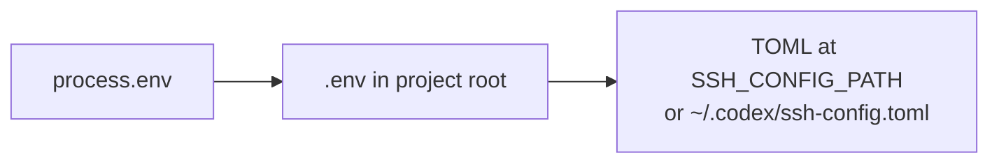
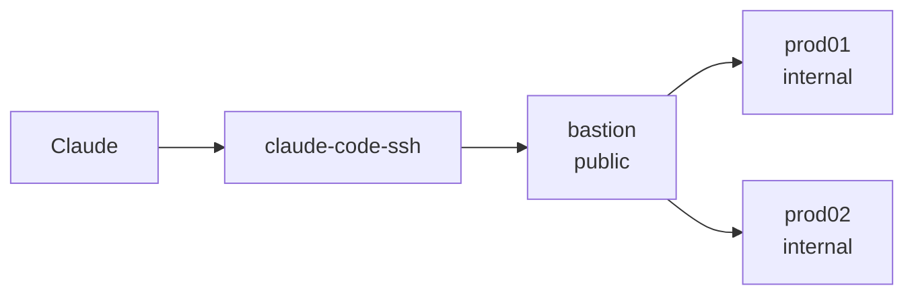

# Configuration

Fleet configuration lives in one of two formats. Claude Code reads `.env`; OpenAI Codex reads TOML. The schemas are identical.

## Loading priority

The server resolves config in this order (later overrides earlier):



Meaning: if the same server is declared in both `.env` and TOML, TOML wins (useful for per-tool overrides without editing the shared file).

## Server schema

Every server has a name and at minimum a host + user. All other fields are optional.

| Field (.env) | Field (TOML) | Purpose | Example |
|---|---|---|---|
| `SSH_SERVER_NAME_HOST` | `host` | IP or DNS | `10.0.0.10` |
| `SSH_SERVER_NAME_USER` | `user` | SSH user | `deploy` |
| `SSH_SERVER_NAME_PORT` | `port` | non-default port | `2222` |
| `SSH_SERVER_NAME_PASSWORD` | `password` | password auth | `...` |
| `SSH_SERVER_NAME_KEYPATH` | `key_path` | private key path | `~/.ssh/id_ed25519` |
| `SSH_SERVER_NAME_PASSPHRASE` | `passphrase` | key passphrase | `...` |
| `SSH_SERVER_NAME_DEFAULT_DIR` | `default_dir` | cwd for commands | `/var/www/app` |
| `SSH_SERVER_NAME_SUDO_PASSWORD` | `sudo_password` | automated sudo | `...` |
| `SSH_SERVER_NAME_PLATFORM` | `platform` | `linux` or `windows` | `windows` |
| `SSH_SERVER_NAME_PROXYJUMP` | `proxy_jump` | bastion server name | `bastion` |

> [!IMPORTANT]
> Prefer key auth. Use `chmod 600` on the config file. Pre-commit hooks in this repo scan for leaked secrets before push.

## ProxyJump (bastion chains)

Define the bastion as a normal server, then reference it by name from other servers:

```env
SSH_SERVER_BASTION_HOST=bastion.example.com
SSH_SERVER_BASTION_USER=jump
SSH_SERVER_BASTION_KEYPATH=~/.ssh/bastion_key

SSH_SERVER_PROD01_HOST=10.0.0.10
SSH_SERVER_PROD01_USER=deploy
SSH_SERVER_PROD01_KEYPATH=~/.ssh/prod_key
SSH_SERVER_PROD01_PROXYJUMP=bastion
```

Claude can now reach `prod01` without you punching holes in the internal VLAN. The pool caches the bastion session and reuses it for every downstream host.



## Profiles

Profiles are preset tool-group enablement configurations for common project shapes. Switch via `ssh-manager tools configure` or set the profile at startup with `SSH_MANAGER_PROFILE=devops`.

| Profile | Groups enabled | Token cost |
|---|---|---|
| `default` | all 7 | ~43k |
| `devops` | core, monitoring, advanced, gamechanger | ~30k |
| `database` | core, database, backup | ~12k |
| `security` | core, sessions, monitoring | ~10k |
| `deployment` | core, advanced, gamechanger | ~22k |
| `minimal` | core only | ~3.5k |

## Per-project overrides

Create `.ssh-manager.config.json` in your project root to override the user-level tool config for that directory:

```json
{
  "profile": "minimal",
  "disabled_groups": ["database", "gamechanger"]
}
```

Claude Code sessions started in that project will only see the enabled tools — useful for environments where only read-only monitoring is appropriate.

## Environment variables for runtime behavior

| Variable | Default | Purpose |
|---|---|---|
| `SSH_LOG_LEVEL` | `INFO` | `DEBUG`, `INFO`, `WARN`, `ERROR` |
| `SSH_STRICT_HOSTS` | unset | if `1`, reject unknown host keys instead of TOFU |
| `SSH_CONFIG_PATH` | `~/.codex/ssh-config.toml` | alternate TOML config path |
| `SSH_POOL_IDLE_MS` | `1800000` | connection pool idle timeout (30 min) |
| `SSH_MANAGER_PROFILE` | `default` | starting profile name |

## Windows hosts

Set `platform=windows`. The MCP server adapts `ssh_execute` to use PowerShell quoting and skips POSIX-only tools (`ssh_service_status`, `ssh_journalctl`, `ssh_docker`, `ssh_systemctl`) for that host.

> [!NOTE]
> See [Limitations](Home#limitations) in Home for the honest list of what Windows support covers and what it doesn't.

## Troubleshooting configuration

If `ssh-manager server list` doesn't show your server:

1. Check for typos: `SSH_SERVER_MYHOST_HOST` (underscore separators, uppercase name).
2. Confirm the `.env` is in the repo root, not the user home directory.
3. Run with `SSH_LOG_LEVEL=DEBUG` and look for `[warn] server X missing required field`.

See [Troubleshooting](Troubleshooting) for connection failures.
