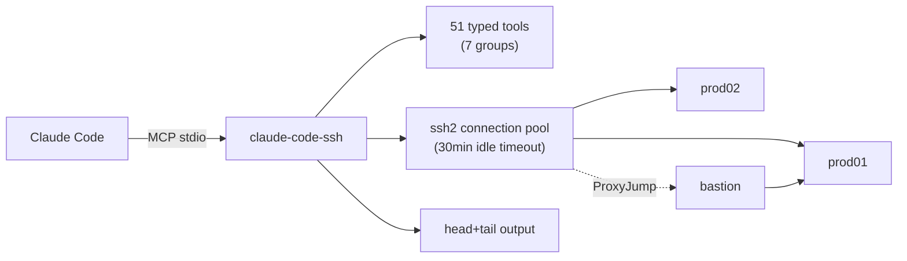
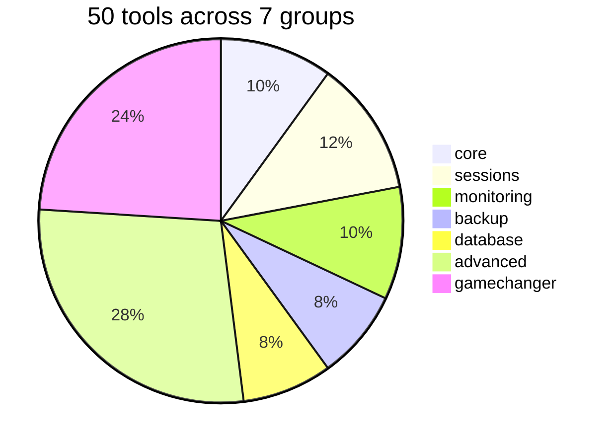

# claude-code-ssh

> MCP server that gives Claude Code 51 typed SSH tools across your server fleet. Pooled connections, per-user gated, context-lean output.



## Quick navigation

| | |
|---|---|
| Setup the server and connect your first host | [Getting started](Getting-started) |
| Declare hosts, keys, bastions, default dirs | [Configuration](Configuration) |
| Browse all 50 tools with schemas and examples | [Tool reference](Tool-reference) |
| How the server, pool, and SSH layer fit together | [Architecture](Architecture) |
| Trust boundaries, credential handling, audit | [Security model](Security-model) |
| Real workflows: backups, rollouts, debugging | [Recipes](Recipes) |
| Failure modes and debug logging | [Troubleshooting](Troubleshooting) |

## 30-second pitch

Claude Code has a bash tool. It can already run `ssh user@host "..."`. But every session you re-brief it on hosts, keys, bastions, sudo users, default dirs. Outputs blow your context window. Connections don't pool. Sudo passwords leak into `ps`.

claude-code-ssh formalizes the fleet once. Claude remembers it across every session. Tools are typed, pooled, head+tail truncated, and constructed to keep credentials off argv and SQL writes out of the query path.

## Install in three commands

```bash
git clone https://github.com/hunchom/claude-code-ssh
cd claude-code-ssh && npm install
claude mcp add ssh-manager node "$(pwd)/src/index.js"
```

> [!TIP]
> Add your first server interactively with `./cli/ssh-manager server add`. Then ask Claude: `list my ssh servers`.

## Tool groups at a glance



Opt in per group via `ssh-manager tools configure`. Minimal mode (5 tools) is ~3.5k tokens; full mode is ~43k.

## Design principles

- **Typed over generic.** A `ssh_backup_create` that accepts a DB type, credentials, retention policy — not "run this 40-char bash pipe".
- **Pool-first.** Reconnects are free. Every tool reuses the client if the host is warm.
- **ASCII output, head+tail truncation.** Logs don't eat your context window.
- **Credentials off argv.** Sudo via stdin. DB via env var or URI. Never interpolated into shell strings.
- **Per-user enablement.** Tools you don't need don't load. Prod tools don't show up in dev environments.

---

> [!NOTE]
> New here? Jump to [Getting started](Getting-started) for a 5-minute walkthrough.
