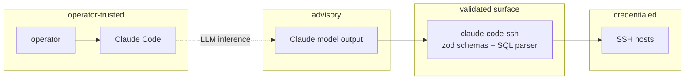
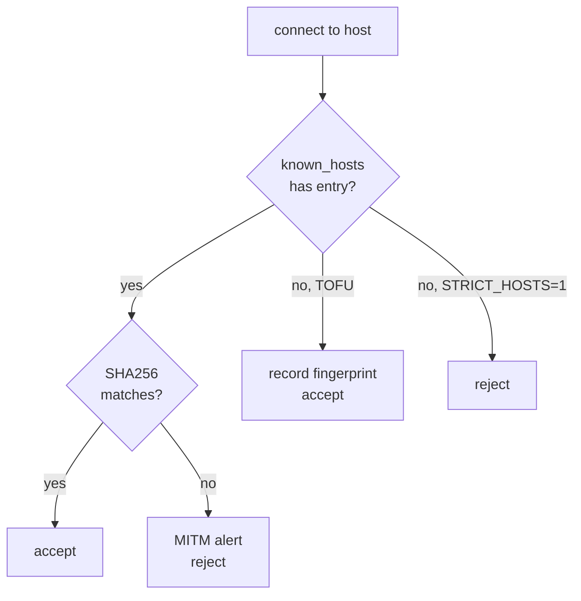

# Security model

claude-code-ssh hands an AI credentialed access to production. The blast radius is not theoretical. This page documents what's defended, what isn't, and where the trust boundaries are.

> [!IMPORTANT]
> If you think you've found a vulnerability, do not open a public issue. Report via [GitHub Security Advisories](https://github.com/hunchom/claude-code-ssh/security/advisories/new). See [SECURITY.md](https://github.com/hunchom/claude-code-ssh/blob/main/SECURITY.md).

## Trust boundaries

- **Operator** trusts Claude Code, their config file, and their SSH keys.
- **Claude model output** is *not* trusted — it can hallucinate, be prompt-injected by log contents, or produce malformed tool calls. Every argument is re-validated server-side.
- **MCP server** is the enforcement point. It owns schema validation, SQL parsing, credential handling, and connection management.
- **SSH hosts** trust the server's key. The server also verifies host keys on its side (SHA256 fingerprint, not TOFU).

## Defenses by concern

### Credential handling

| Concern | Defense |
|---|---|
| Sudo password in `ps` | Piped via stdin to `sudo -S`. Never in argv. |
| DB password in shell history | Passed via env var (`MYSQL_PWD`, `PGPASSWORD`) or connection URI, not argv. |
| Keys on disk | Read directly by ssh2 from `key_path`. Not copied, logged, or serialized. |
| Passphrase-protected keys | `passphrase` field decrypts in memory; never written anywhere. |

### Host verification

- Every connection SHA256-hashes the presented host key and compares against `known_hosts`.
- Base64 padding is normalized before comparison (known_hosts is inconsistent across OpenSSH versions).
- Unknown hosts default to TOFU (trust on first use, record fingerprint).
- `SSH_STRICT_HOSTS=1` rejects unknown hosts outright — no TOFU, no recording.
- A mismatch (stored fingerprint ≠ presented) raises a `host fingerprint mismatch` error and aborts the connection.

### SQL execution

`ssh_db_query` accepts only `SELECT`. A token-level parser rejects anything else. This is structural, not pattern-matched:

- Supports nested CTEs with `WITH`.
- Rejects `SELECT INTO`, `SELECT ... FOR UPDATE`, stored procedures.
- Rejects stacked queries (`SELECT 1; DROP TABLE users`).
- Rejects comment-based hiding (`/* */ DROP TABLE users --`).

For writes, Claude must use `ssh_execute` against the DB CLI. This is an intentional friction point — writes require explicit intent and are logged.

### Shell injection

The legacy `execCommand` path used to interpolate `cwd` directly into the shell string. That's fixed (v3.2.2): `cwd` is shell-quoted via `shQuote()` before concatenation.

All modern tool handlers use `ssh2`'s `exec()` directly (no shell interpolation). User-supplied strings pass as arguments, not command fragments.

### Proxy jump chains

Bastion hosts are first-class pool entries. A command to `prod01 via bastion`:

1. Pool looks up bastion. If absent, dials and authenticates.
2. Pool looks up prod01. If absent, dials *through* the bastion via `forwardOut`.
3. Both connections cache separately with independent idle timers.

The bastion is never asked to execute commands on behalf of prod01 — forwarding is channel-level, not shell-level.

## What's not defended

| Concern | Why | Mitigation |
|---|---|---|
| Compromised private key on disk | Outside the server's trust surface | Key rotation, `chmod 600`, hardware keys |
| Social engineering of operator | Out of scope | Training, runbooks |
| DoS against the MCP process | Single-tenant by design | Restart; file an issue if it's a bug |
| Prompt injection via log contents that makes Claude issue bad tool calls | Server validates every call, but semantic misuse is possible | Tool group gating, minimal profiles in prod |

## Audit trail

- Every SSH connection attempt logs to `~/.ssh-manager.log` with timestamp, host, auth method, and outcome.
- Every tool invocation logs to MCP stderr (visible in Claude Code's dev mode).
- `SSH_LOG_LEVEL=DEBUG` includes full tool I/O.
- There's no built-in SIEM integration yet — log files are plain JSON-lines, easy to ship to an external collector.

## Operator hardening checklist

- [ ] Key-based auth only (no passwords in config).
- [ ] `chmod 600` on `.env` and any TOML configs.
- [ ] `SSH_STRICT_HOSTS=1` in production environments.
- [ ] Dedicated deploy keys with `command=` and `from=` restrictions in `~/.ssh/authorized_keys` on each host.
- [ ] Per-project `.ssh-manager.config.json` restricting to minimal profile for dev environments.
- [ ] Periodic review of `~/.ssh-manager.log` for anomalous tool invocations.
- [ ] `SUDO_PASSWORD` set only where automated sudo is genuinely needed (not blanket).
- [ ] Rotate SSH keys on a schedule; `ssh_key_manage` tool can help.
