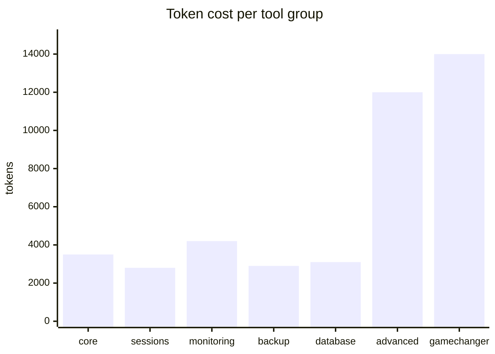

# Tool reference

50 tools across 7 groups. Claude picks them based on your intent — you rarely name them directly. This page exists so you can audit what Claude has access to and disable groups you don't need.

> [!TIP]
> `ssh-manager tools list` prints the currently-enabled tools and the token cost of your active set. `ssh-manager tools configure` flips groups on/off interactively.

## Groups at a glance

| Group | Tools | Purpose |
|---|---:|---|
| [core](#core-5) | 5 | execute, upload, download, list servers, health check |
| [sessions](#sessions-4) | 4 | persistent shells that survive across turns |
| [monitoring](#monitoring-6) | 6 | services, processes, logs, alerts |
| [backup](#backup-4) | 4 | create, list, restore, schedule |
| [database](#database-4) | 4 | dump, import, list, read-only query |
| [advanced](#advanced-14) | 14 | tunnels, keys, sync, deploy, hooks, groups, aliases |
| [gamechanger](#gamechanger-14) | 14 | cat, diff, edit, docker, journalctl, port test, tail streams, session v2, deploy artifact, plan |

---

## core (5)

| Tool | Signature summary | Example prompt |
|---|---|---|
| `ssh_list_servers` | — | "list my servers" |
| `ssh_execute` | `server, command, cwd?, timeout_ms?` | "run `uptime` on prod01" |
| `ssh_upload` | `server, local_path, remote_path` | "upload ./deploy.sh to prod01:/tmp" |
| `ssh_download` | `server, remote_path, local_path` | "download /var/log/app.log from prod01" |
| `ssh_health_check` | `server` | "health check prod01" |

## sessions (4)

Persistent shells. The session keeps its cwd, env, and shell state across multiple Claude turns.

| Tool | Purpose |
|---|---|
| `ssh_session_start` | open a named session, returns `session_id` |
| `ssh_session_send` | send a command to an existing session |
| `ssh_session_list` | list active sessions with age and last activity |
| `ssh_session_close` | close a session and release the channel |

> [!TIP]
> Use sessions for long workflows that need shell state (e.g. activating a venv, `set -x` debug mode, or multi-step migrations).

## monitoring (6)

| Tool | Purpose |
|---|---|
| `ssh_service_status` | systemd unit status (`active`, `enabled`, etc.) |
| `ssh_process_manager` | list / filter / kill processes |
| `ssh_tail` | real-time log tail with regex filter |
| `ssh_monitor` | CPU / RAM / disk / net snapshot |
| `ssh_history` | per-server command history |

## backup (4)

| Tool | Supports |
|---|---|
| `ssh_backup_create` | MySQL, PostgreSQL, MongoDB, plain file tarballs |
| `ssh_backup_list` | all backups on a server with size + timestamp |
| `ssh_backup_restore` | restore any backup to same or different host |
| `ssh_backup_schedule` | cron-based automatic backups |

## database (4)

| Tool | Notes |
|---|---|
| `ssh_db_dump` | `mysqldump`, `pg_dump`, `mongodump` with env-var creds |
| `ssh_db_import` | restore SQL dumps, transactional |
| `ssh_db_list` | list databases, tables, collections |
| `ssh_db_query` | **SELECT only** — token-level SQL parser rejects writes |

> [!CAUTION]
> `ssh_db_query` is intentionally read-only. For writes, use `ssh_execute` against the DB CLI so the intent is explicit and audited.

## advanced (14)

Click to expand

| Tool | Purpose |
|---|---|
| `ssh_tunnel_create` | local, remote, or SOCKS forwarding |
| `ssh_tunnel_list` | active tunnels |
| `ssh_tunnel_close` | close a tunnel by id |
| `ssh_deploy` | atomic upload with rollback on healthcheck fail |
| `ssh_sync` | rsync-based bidirectional sync |
| `ssh_execute_group` | run a command across a server group |
| `ssh_group_manage` | define, edit, list server groups |
| `ssh_key_manage` | list, generate, rotate SSH keys |
| `ssh_alias` | server aliases |
| `ssh_command_alias` | per-server command aliases |
| `ssh_hooks` | pre/post-connection hooks |
| `ssh_profile` | tool profile management |
| `ssh_execute_sudo` | sudo with stdin-piped password |
| `ssh_connection_status` | inspect the pool |

## gamechanger (14)

Click to expand

| Tool | Purpose |
|---|---|
| `ssh_cat` | read a remote file with head / tail / grep / line-range filters |
| `ssh_diff` | diff a local file against a remote file |
| `ssh_edit` | in-place edit via sed-style ops |
| `ssh_docker` | docker ps / logs / exec / stats on remote |
| `ssh_journalctl` | systemd journal with unit filter and time range |
| `ssh_systemctl` | start / stop / restart / status / list-unit-files |
| `ssh_port_test` | TCP probe chain across hosts (reachability matrix) |
| `ssh_tail_start` | start a persistent tail; returns session_id |
| `ssh_tail_read` | read buffered lines from an active tail |
| `ssh_tail_stop` | close a tail session |
| `ssh_session_memory` | store/retrieve notes scoped to a session |
| `ssh_session_replay` | replay recorded session commands |
| `ssh_deploy_artifact` | multi-file deploy with manifest |
| `ssh_plan` | propose a tool plan for a complex task, user confirms before execution |

---

## Token cost by group

Enabling every group costs ~43k tokens of tool schemas per turn. The minimal profile (`core` only) is ~3.5k.

Disable the groups you don't use. You can always toggle them back with `ssh-manager tools enable <group>`.
